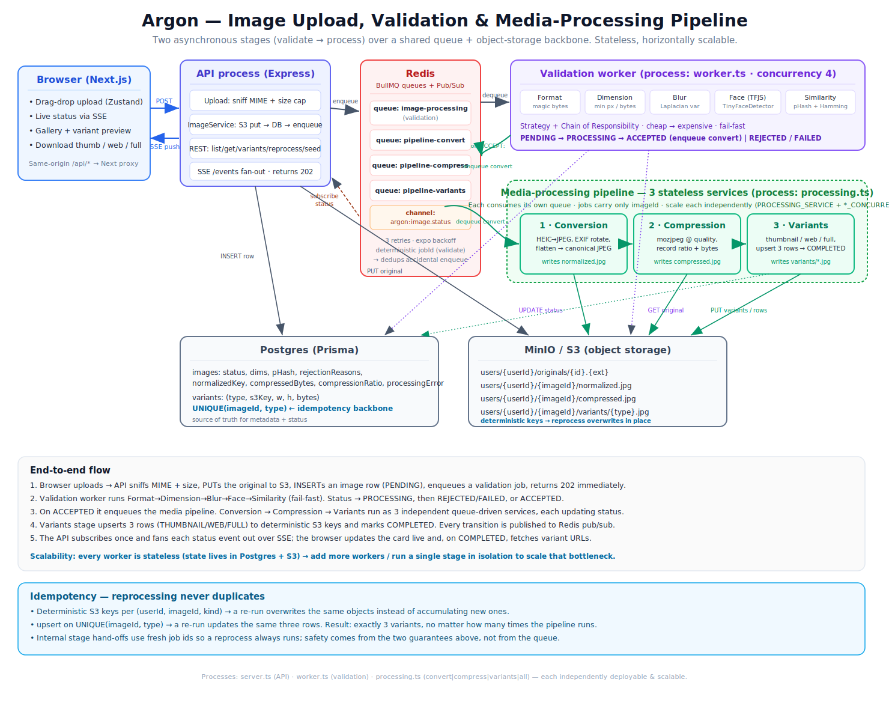
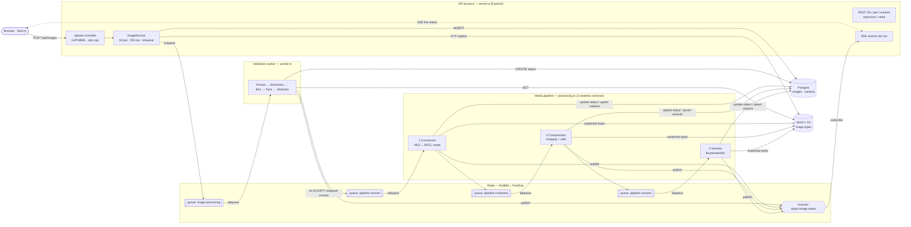
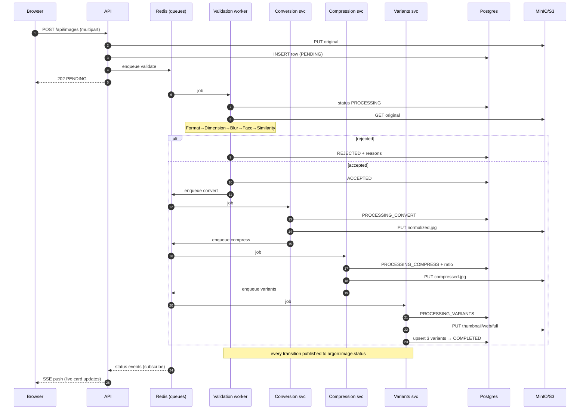
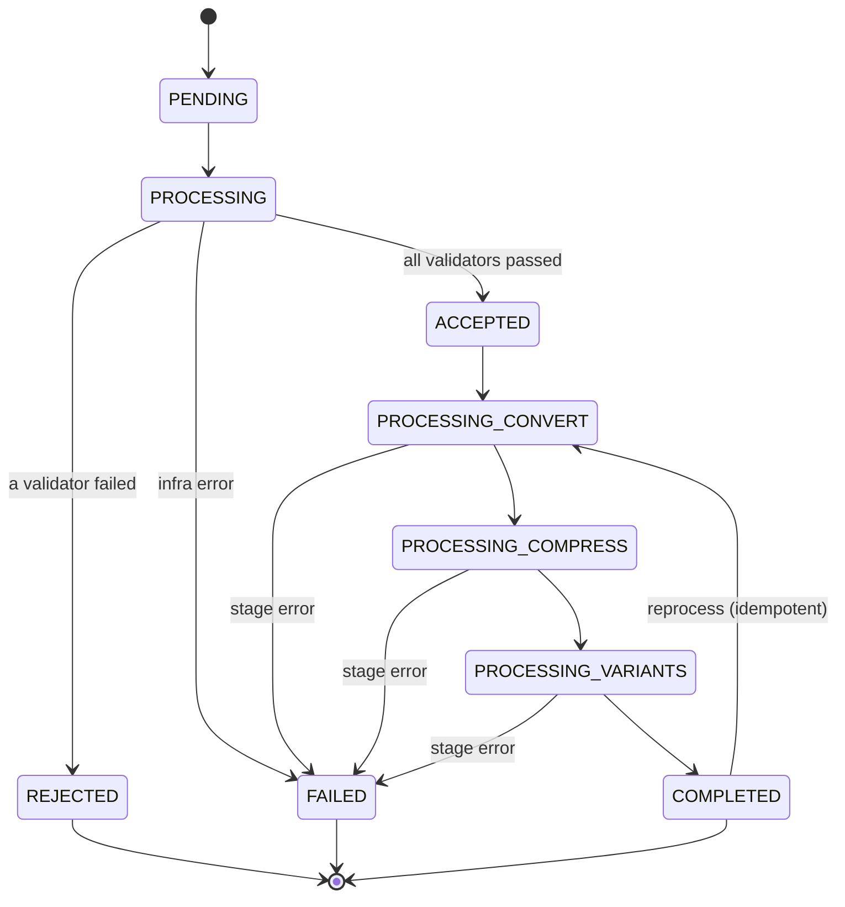
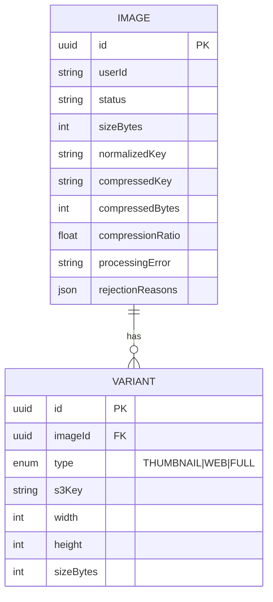
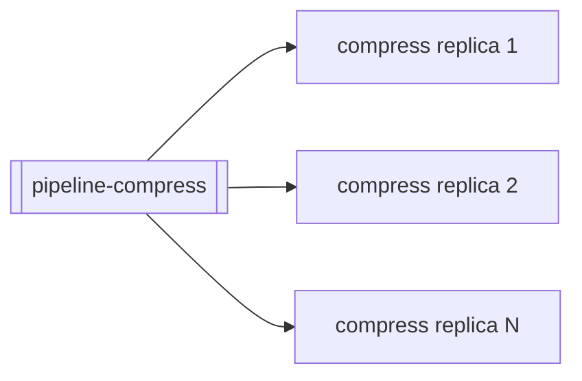

# Argon-BE — System Architecture

A two-stage asynchronous image platform:

1. **Validation** (Part 1) — accept an upload and run it through quality gates.
2. **Media processing** (Part 2) — convert → compress → generate variants.

Both stages run **off the request path** as queue-driven workers, share one
Postgres + object-storage backbone, and are **stateless and independently
scalable**.

---

## 1. System overview

---

## 2. The media pipeline, end to end

---

## 3. Status state machine

---

## 4. Data model

`VARIANT` has a **`UNIQUE(imageId, type)`** constraint — the backbone of
idempotent reprocessing.

---

## 5. Components & responsibilities

### API process — `server.ts`
- Thin HTTP layer. Sniffs MIME from magic bytes, enforces the size cap, PUTs the
  original to S3, writes the row, enqueues a validation job, returns **202**
  immediately — never blocks on processing.
- Serves reads (`list` / `get` / `variants`), control (`reprocess`), and the
  load-test entry (`seed`).
- Owns one Redis subscription and fans status events out to all SSE clients.

### Validation worker — `worker.ts`
- Runs the Part-1 pipeline: **Strategy + Chain of Responsibility**, ordered
  cheap → expensive, short-circuits on first failure.
- On `ACCEPTED`, enqueues the media pipeline (hand-off point between the two stages).

### Media pipeline — `processing.ts`
Three services, **one BullMQ queue each**, chained `convert → compress → variants`:

| # | Service | Reads | Does | Writes |
|---|---------|-------|------|--------|
| 1 | Conversion | original | normalise to an upright canonical JPEG (HEIC→JPEG, EXIF rotate, flatten) | `normalized.jpg`, `normalizedKey` |
| 2 | Compression | normalized | mozjpeg re-encode at quality; compute ratio | `compressed.jpg`, `compressedBytes`, `compressionRatio` |
| 3 | Variants | compressed | resize to thumbnail/web/full, upsert a row each | `variants/*.jpg`, 3 `Variant` rows → `COMPLETED` |

`PROCESSING_SERVICE` selects which service(s) a process runs (`all` for dev, or a
single stage to scale it alone); `*_CONCURRENCY` tunes each independently.

### Redis (BullMQ + Pub/Sub)
- **Queues** decouple producers from consumers and provide retries (3×,
  exponential backoff) and retention for inspection.
- **Pub/Sub** carries status events cross-process so any API replica can serve
  SSE for any image.

### Postgres (Prisma)
- Source of truth for metadata + status. Indexed for list-by-user and similarity
  lookup. Holds the `variants` table with the unique constraint.

### MinIO / S3
- Stores all image bytes under **deterministic keys**; the DB stores only the
  keys. Same SDK code targets real AWS S3 (flip `AWS_S3_ENDPOINT`).

---

## 6. Why this shape — design rationale

- **Two processes, three services, one backbone.** Each unit does one thing and
  is independently deployable. The **queue is the service boundary**: splitting a
  stage into its own container means pointing its worker at the same Redis.
- **Stateless workers.** A job carries only an `imageId`; the worker rehydrates
  everything from Postgres + S3. So *any* worker can take *any* job — that is what
  makes horizontal scaling trivial.
- **Fail-fast validation, fail-safe processing.** Validation short-circuits to
  save the expensive face/duplicate checks; processing marks `FAILED` with a
  stage-tagged `processingError` instead of silently dropping a job.
- **Idempotency by construction** (see below) rather than by coordination.

---

## 7. Scalability model

- A stage that backs up is its own queue → run more consumers of *just that
  queue*: `PROCESSING_SERVICE=compress COMPRESS_CONCURRENCY=8 npm run dev:processing`.
- Because workers are stateless, adding replicas needs no coordination, sticky
  routing, or shared memory.
- The load test (`npm run loadtest`) submits a concurrent batch and reports
  throughput + p50/p95 so you can measure the effect of adding workers.

---

## 8. Idempotency — reprocessing never duplicates

1. **Deterministic S3 keys** per `(userId, imageId, kind)` → a re-run overwrites
   the same objects.
2. **`upsert` on `UNIQUE(imageId, type)`** → a re-run updates the same three rows.

Result: **exactly three variants**, no matter how many times the pipeline runs.
Internal stage hand-offs use fresh job ids so an explicit reprocess always runs;
safety comes from the two guarantees above, not from queue de-duplication.

---

## 9. Failure handling

- Each stage wraps work in a handler: on the final retry it sets `status=FAILED`
  and writes a human-readable `processingError` (e.g. `[convert] corrupt header`),
  then publishes the event — the job never disappears silently.
- Transient/infra errors throw and let BullMQ retry (3×, exponential backoff);
  clean rejections do not retry.
